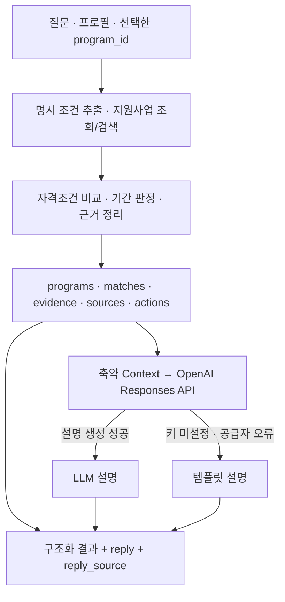

# FinBridge Backend

예비창업자·소상공인·프리랜서를 위한 **지원사업 검색·조건 매칭·재무 계산·근거 기반 AI 설명** 백엔드입니다. 2026 금융 AI Challenge 팀 `start`의 FinBridge 서비스로 개발했습니다.

지원사업을 추천할 때는 **어떤 조건을 비교했는지**, 재무 결과를 보여 줄 때는 **어떤 입력과 계산식을 사용했는지**를 함께 반환합니다. 검색과 판정, 금융 계산은 코드가 수행하고, OpenAI Responses API는 구조화된 결과를 사용자에게 설명합니다.

**기본 실행은 합성 데모 6건으로 동작하며, API Key 없이 검색·매칭·재무 계산과 템플릿 채팅을 실행할 수 있습니다.** 허가된 기업마당 Snapshot은 별도 경로로 연결할 수 있습니다.

> Frontend: [finbridge-frontend](https://github.com/start-finance-ai/finbridge-frontend) · API 문서: 로컬 실행 후 [Swagger UI](http://127.0.0.1:8000/docs)
>
> 상세 설계는 [아키텍처](docs/FINANCE_AI_ARCHITECTURE.md), [조건 Schema](docs/ELIGIBILITY_SCHEMA.md), [매출 업로드 Schema](docs/SALES_UPLOAD_SCHEMA.md)를 참고하세요. 과거 배포·검증 기록은 [개발 상태 문서](docs/FINANCE_AI_DEV_STATUS.md)에 보존되어 있습니다.

## 핵심 설계

| 설계 | 구현 방식 | 목적 |
| --- | --- | --- |
| 판정·계산과 AI 설명 분리 | 규칙 기반 Matching, `Decimal` 계산, 구조화 결과를 받은 LLM 설명 | 생성 문장과 실제 비교·계산 결과를 구분 |
| 근거를 포함한 조건 Schema | `condition_id`, `source_field`, `evidence_text`, 비교 연산·단위·적용 주체 | 조건별 판정 이유와 입력 자료의 근거 추적 |
| 보수적인 자격 판정 | 공통 조건 AND, 대안 경로 OR, 전역 제외 조건, 추출 완전성 검사 | 명시적 불일치와 판단 보류를 구분하고 조건별 근거 제공 |
| 구조화·키워드 검색 | 필터, 정확 일치·부분 일치, 필드 가중치, 지역 우선순위 | 검색 순위를 코드로 재현하고 일치 필드를 반환 |
| LLM 장애 격리 | `AIProvider` Protocol, 오류 유형 분류, 제한된 재시도, 템플릿 폴백 | 설명 생성 실패 시에도 검색·매칭 결과 유지 |
| 검증 후 Snapshot 게시 | 원본 응답 보존, ID·정규화 검증, manifest의 원자적 교체 | 수집 실패가 기존 서비스 데이터 교체로 이어지지 않음 |
| 파일 기반 Data Layer | 정규화된 Program을 메모리 Repository에서 조회 | 런타임 DB 없이 기본 데모를 재현 |

## 처리 흐름

아래는 `/chat`의 지원사업 설명 흐름입니다. 재무·소득·매출 계산은 별도의 계산 API에서 실행합니다.



### 1. Snapshot 정규화와 검색

기업마당 응답의 `pblancId`, 사업명, 기관, 지원대상, 신청기간 등을 Pydantic `Program`으로 정규화합니다. 원본 필드와 출처 구분을 유지하고, 중복 ID나 잘못된 구조는 데이터 오류로 처리합니다. `ProgramRepository`는 첫 로드 후 정규화 결과를 메모리에 보관합니다.

`ProgramRetrievalService`는 다음 기준으로 후보를 찾습니다.

- **조건 필터:** 지역·사업 상태·사용자 유형·분야·기관·업종. 채팅 경로에서는 추출한 연령·업력 등 프로필도 활용합니다.
- **텍스트 정규화:** HTML 태그 제거, 공백·문장부호 정리, 일부 별칭·조사·검색 불용어 처리.
- **가중 검색:** 사업명·기관·분야·자격 근거·요약 등 필드별 정확 일치와 키워드 일치를 점수화합니다. 해시태그는 다른 필드가 일치한 후보의 보조 점수로 사용합니다.
- **지역 우선순위:** 동일 지역 → 전국 대상 → 명시적 타지역 예외 → 지역 불명 순서로 정렬하고, 명확한 타지역 전용 후보는 제외합니다.
- **기간 조건:** 채팅의 명시적인 현재 신청 가능·마감 임박 요청에 따라 기간 필터와 마감순 정렬을 적용합니다.

응답의 `retrieval_score`는 정수 검색 점수이고, `matched_fields`는 일치한 필드 목록입니다. **자격 충족 확률이나 선정 확률을 의미하지 않습니다.** 일반적인 의미 검색이나 임베딩 검색을 구현한 것으로 해석하지 않습니다.

구현: [Repository](app/data/program_repository.py) · [Retrieval](app/retrieval/program_retrieval.py) · [명시 프로필 추출](app/retrieval/query_understanding.py)

### 2. 설명 가능한 자격조건 매칭

`EligibilityExtractor`는 보수적인 Regex baseline으로 명시 조건을 추출합니다. 조건은 `condition_type`, `subject`, `operator`, `value`, `unit`, `polarity`, `condition_role`과 원문 근거를 함께 가집니다. 지원 연산은 `EQ`, `GT`, `GTE`, `LT`, `LTE`, `BETWEEN`, `IN`, `EXISTS`입니다.

조건 구조는 공통 조건과 대안 그룹을 분리한 DNF 형태입니다.

```text
공통 조건 모두 충족
AND (대안 그룹 1의 모든 조건 OR 대안 그룹 2의 모든 조건 OR ...)
AND 전역 제외 조건에 해당하지 않음
```

`EligibilityMatcher`는 명확한 제외·불일치를 먼저 확인한 뒤, Program-level 추출 상태와 비교가 완료됐는지를 검사합니다. 결과는 다음 네 가지로 반환합니다.

| 상태 | 의미 |
| --- | --- |
| `MATCH` | 확인된 자격 조건과 현재 입력이 일치하고 추출·비교 검사를 통과 |
| `NO_MATCH` | 명시 조건이 불일치하거나 전역 제외 조건에 해당 |
| `NEEDS_REVIEW` | 필요한 사용자 값 미입력, 추가 근거 검토 또는 자동 비교 미지원 |
| `UNKNOWN` | 지원대상 조건의 근거·구조가 부족해 비교 기준을 구성하지 못함 |

예를 들어 연령 조건이 `19~39세`라면 28세는 해당 조건을 충족하지만, 나이를 입력하지 않은 경우는 `NO_MATCH`가 아니라 `NEEDS_REVIEW`입니다. 별첨 확인이 남은 공고도 일부 조건만 맞는다는 이유로 최종 `MATCH`로 올리지 않습니다.

결과에는 `condition_results`, `reason`, `evidence`, `source`를 포함합니다. `MATCH`는 현재 확인한 조건의 일치 결과이며, 실제 최종 지원 자격이나 선정을 보장하지 않습니다.

구현: [Condition Schema](app/schemas/eligibility.py) · [Extractor](app/eligibility/extractor.py) · [Matcher](app/eligibility/matcher.py)

### 3. 근거 기반 LLM 설명과 폴백

`ChatService`가 검색·매칭·기간 판정 결과를 먼저 구성하고 `AIProvider.explain()`에 설명을 요청합니다. 모델 기본값은 `gpt-5.6-luna`이며 `OPENAI_MODEL`로 변경할 수 있습니다.

- **GENERAL:** 메시지에 명시된 지역·연령·업력·사업 상태 등을 Regex로 추출합니다. 지원사업 검색 intent인 경우 최대 5개 후보를 조회합니다. 전달된 `focus_profile` 필드는 추출값보다 우선합니다.
- **FOCUS:** `focus_profile`과 선택한 `program_id`로 특정 사업의 조건 비교·설명을 요청할 수 있습니다. `FOCUS`만 지정해 전체 사업을 자동 탐색하는 구조는 아닙니다.
- **Context 축약:** LLM에는 최대 3개 사업, 사업별 최대 3개 근거를 전달합니다. 근거와 신청방법 텍스트 길이를 제한하며, 응답의 전체 후보·출처·행동 목록은 별도로 유지합니다.
- **OR 조건 설명 보정:** 이미 충족한 대안 경로가 있을 때 다른 OR 경로의 미충족 조건을 필수 조건처럼 다시 요구하지 않도록 설명 Context를 정리합니다.
- **출력 예산:** 기본 `max_output_tokens=1200`, `reasoning.effort=low`. 짧고 완결된 설명 형식을 프롬프트로 요청합니다.
- **오류 처리:** timeout·일시적 rate limit·서버/연결 오류와 일부 HTTP 오류는 최대 1회 재시도합니다. 인증·quota 오류는 재시도하지 않습니다. 빈 응답과 incomplete 응답도 오류로 처리합니다.
- **폴백:** 공급자 오류가 발생하면 `reply_source=TEMPLATE_FALLBACK`, `model=null`로 응답하면서 이미 생성한 구조화 결과를 유지합니다. 로그에는 오류 클래스와 reason code를 기록합니다.

`POST /chat`의 응답은 `reply`, `reply_source`, `model`, `programs`, `matches`, `evidence`, `sources`, `actions`를 포함합니다. 출처가 `DEMO`인 사업을 설명하면 응답 앞에 데모 안내를 붙입니다.

존재하지 않는 사업·금액·조건을 만들지 않도록 프롬프트를 제한하지만, 생성 문장의 모든 사실을 별도 검증기로 보증하는 구조는 아닙니다. **구조화된 판정과 출처를 확인 기준으로 사용합니다.** 대화는 stateless이며 `session_id`를 서버에 저장하지 않습니다. OpenAI 호출에는 `store=False`를 설정합니다.

구현: [ChatService](app/services/chat_service.py) · [Provider](app/ai/provider.py) · [Prompt](app/ai/prompts.py) · [Fallback](app/ai/fallback.py)

### 4. 재무·소득·매출 계산

계산 API는 LLM을 호출하지 않습니다. 내부 금액·비율은 `Decimal` precision 50으로 계산하고, 최종 응답에서 소수 둘째 자리 `ROUND_HALF_UP`을 적용합니다.

| API | 계산 내용 | 경계값 처리 |
| --- | --- | --- |
| `/risk/calculate` | 가용 현금, 원리금균등 월상환액, 월현금흐름, 현금 소진액, runway, 해당 시점 잔존 채무 | 무이자·대출 없음 별도 처리, 현금흐름이 비음수이고 가용 현금이 양수이면 runway는 `null` |
| `/income-stability/calculate` | 정확히 6개월 소득의 평균, 모집단 표준편차, 변동계수(CV), 최솟값·최댓값 | 평균이 0이면 CV는 `null`; 음수·비유한 값·잘못된 길이 거부 |
| `/sales-analysis/analyze` | 월별 합계, 평균·최고·최저 매출, 최근 3개월 대 이전 3개월 추세, CV, 전월 대비 변화율 | 누락 월을 0원으로 채우지 않음; 기간 부족·월 공백·분모 0은 값과 계산 불가 이유를 구분 |

Risk Calculator의 핵심 관계는 다음과 같습니다.

```text
가용 현금 = 자기자본 + 대출금 - 초기비용
월현금흐름 = 월매출 - 월지출 - 월상환액
runway = 가용 현금 / 월현금 소진액  (가용 현금 > 0, 월현금흐름 < 0)
```

월상환액은 입력한 연이율을 월이율로 환산한 원리금균등상환 공식으로 계산합니다. 매출·비용 고정 가정이며 세금·수수료·추가 차입 등을 반영하지 않습니다. 신용평가·대출 승인 예측이나 매출 예측 모델은 아닙니다.

매출 업로드는 `.csv`와 `.xlsx`, 최대 **5 MiB·50,000개 데이터 행**을 지원합니다. 필수 열은 `transaction_date`, `sales_amount`이며 명시적인 한국어 열 별칭도 허용합니다. UTF-8/CP949 CSV와 XLSX read-only/data-only 파싱을 사용합니다. 필수값 오류·음수 매출·중복 의미의 열·복수 유효 시트는 임의로 보정하거나 선택하지 않고 오류를 반환합니다. 파일 원문과 행 자료를 DB에 저장하거나 LLM에 전달하지 않습니다.

구현: [Risk](app/calculation/risk.py) · [Income](app/calculation/income_stability.py) · [Sales](app/calculation/sales_analysis.py) · [Upload Parser](app/data/sales_upload.py)

## 기술 스택과 코드 구성

| 영역 | 구성 |
| --- | --- |
| 실행 환경 | Python `3.14.3` (`.python-version`) |
| API·계약 | FastAPI `0.141.1`, Pydantic `2.13.4`, Uvicorn `0.52.1` |
| 설명 AI | OpenAI Python SDK `3.6.0`, Responses API, 공급자 Protocol |
| 데이터·계산 | JSON Snapshot, in-memory Repository, Regex, `Decimal` |
| 파일 처리 | Python `csv`, openpyxl `3.1.5`, defusedxml `0.7.1`, python-multipart |
| 검증 | pytest `9.1.1`, httpx ASGITransport, 주입 가능한 Provider/Transport |
| 배포 | Railway Railpack, Dashboard 설정, Vercel Frontend와 CORS 연결 |

의존성 버전은 [requirements.txt](requirements.txt)에 고정되어 있습니다.

| 디렉터리 | 책임 |
| --- | --- |
| [app/api](app/api) | HTTP 라우팅·오류 응답·입출력 Schema 연결 |
| [app/schemas](app/schemas) | Program·Condition·Profile·Chat·계산 계약 및 입력 검증 |
| [app/data](app/data) | Snapshot Loader·정규화·Repository·수집·업로드 파싱 |
| [app/retrieval](app/retrieval) | 명시 프로필 추출·조건 필터·키워드 검색·정렬 |
| [app/eligibility](app/eligibility) | 조건 추출·공통/대안/제외 조건 비교 |
| [app/calculation](app/calculation) | 재무·소득·월별 매출 계산 |
| [app/services](app/services) | Program/Chat 유스케이스와 응답 조립 |
| [app/ai](app/ai) | LLM Protocol·공급자·프롬프트·템플릿 폴백 |
| [scripts](scripts) | 수동 수집·추출 baseline 점검·Review Pack 평가 |
| [data/demo](data/demo) · [tests](tests) · [docs](docs) | 합성 예제·회귀 테스트·설계 및 검증 기록 |

`create_app(ai_provider=...)`로 AI 공급자를 주입할 수 있고, 기업마당 수집기도 `BizinfoTransport`를 주입받습니다. 테스트에서는 실제 외부 호출 대신 성공·실패 응답을 재현할 수 있습니다.

## 빠른 시작

### 설치와 실행 — PowerShell

`.python-version`에 지정한 Python `3.14.3`을 기준으로 저장소 루트에서 실행합니다.

```powershell
git clone https://github.com/start-finance-ai/finbridge-backend.git
Set-Location finbridge-backend
python -m venv .venv
.venv\Scripts\python.exe -m pip install -r requirements.txt
.venv\Scripts\python.exe -m uvicorn app.main:app --reload
```

API 문서는 `http://127.0.0.1:8000/docs`, 상태 확인은 `GET /health`입니다. 루트 `/`에는 별도 라우트가 없어 404가 정상입니다. 기본 데모를 사용하면 기업마당·OpenAI Key가 필요하지 않습니다.

### 데모 검색·매칭·설명

서버를 실행한 상태에서 다른 PowerShell 창에 입력합니다.

```powershell
$apiBase = "http://127.0.0.1:8000"
Invoke-RestMethod "$apiBase/health"
Invoke-RestMethod "$apiBase/programs?query=$([uri]::EscapeDataString('창업'))"

$profile = @{ region = "대구"; business_region = "대구"; age = 28; pre_founder = $true }
$matchBody = @{ program_id = "DEMO_002"; profile = $profile } | ConvertTo-Json -Depth 5
Invoke-RestMethod "$apiBase/programs/match" -Method Post -ContentType "application/json; charset=utf-8" -Body ([System.Text.Encoding]::UTF8.GetBytes($matchBody))

$chatBody = @{
    mode = "FOCUS"
    program_id = "DEMO_002"
    focus_profile = $profile
    message = "이 사업의 조건과 확인할 사항을 설명해줘"
} | ConvertTo-Json -Depth 5
Invoke-RestMethod "$apiBase/chat" -Method Post -ContentType "application/json; charset=utf-8" -Body ([System.Text.Encoding]::UTF8.GetBytes($chatBody))
```

매칭 응답의 핵심 값은 다음과 같습니다. 전체 응답에는 사업 정보와 조건별 근거도 포함됩니다.

```json
{
  "match_status": "MATCH",
  "reason": "ELIGIBILITY_PATH_SATISFIED"
}
```

OpenAI Key가 없으면 채팅의 `reply_source`는 `TEMPLATE_FALLBACK`입니다. 실제 설명 생성을 사용하려면 `.env.example`을 `.env`로 복사하고 `OPENAI_API_KEY`를 설정합니다. Key는 Git에 커밋하지 않습니다. 환경변수가 `.env`보다 우선하며, 실제 모델 호출에는 비용이 발생할 수 있습니다.

## API 계약

| Method | 경로 | 입력·역할 |
| --- | --- | --- |
| GET | `/health` | 기동 상태 확인 |
| GET | `/programs` | 지원사업 검색·필터, `query`, `region`, `business_status`, `user_type`, `category`, `provider`, `industry`, `limit` |
| GET | `/programs/{program_id}` | 정규화된 Program 상세 |
| POST | `/programs/match` | `program_id` + `profile` → 조건별 판정과 근거 |
| POST | `/chat` | `message` + 선택적 `mode`, `focus_profile`, `program_id`, `session_id` → 설명과 구조화 결과 |
| POST | `/risk/calculate` | 초기비용·자본·매출·지출·대출·금리·상환기간 → 재무 시뮬레이션 |
| POST | `/income-stability/calculate` | `monthly_incomes` 6개 → 소득 변동성 지표 |
| POST | `/sales-analysis/analyze` | `file` multipart 업로드 → 매출 집계·추세·데이터 품질 |
| GET | `/docs` | Swagger UI |

`GET /programs`의 `limit` 기본값은 5, 최댓값은 20입니다. `/chat`의 `message`는 1~4,000자입니다. JSON 요청 Schema는 정의하지 않은 필드를 거부합니다. 잘못된 입력은 422, 없는 사업은 404, 읽을 수 없는 Snapshot은 503으로 처리합니다. 업로드 오류는 `detail.error_code`와 필요한 행·필드 정보로 구분합니다.

전체 요청·응답은 [app/schemas](app/schemas)와 실행 중인 Swagger UI를 확인하세요.

## 데이터 선택과 수동 갱신

현재 Git에 포함된 사업 데이터는 직접 작성한 **합성 데모 6건**입니다. `source=DEMO`, `[데모]` 제목으로 표시하고 실제 신청 링크·문서 링크·문의처를 제공하지 않습니다. 데모 검색·매칭 결과를 실데이터 성능으로 해석하지 않습니다.

서버 생성 시 Snapshot 선택 순서는 다음과 같습니다.

1. `FINBRIDGE_BIZINFO_SNAPSHOT`으로 명시한 파일
2. `service_ready.json`에 게시된 수집 Snapshot
3. 기본 `data/demo/finbridge_demo.json`

명시적으로 지정한 Snapshot이 잘못되면 해당 오류를 503으로 반환하며, 다른 데이터로 조용히 대체하지 않습니다. `FINBRIDGE_BIZINFO_SNAPSHOT`은 프로세스 환경변수로 설정합니다.

허가된 실데이터를 직접 지정하는 예:

```powershell
$env:FINBRIDGE_BIZINFO_SNAPSHOT = "C:\private-data\bizinfo_snapshot.json"
.venv\Scripts\python.exe -m uvicorn app.main:app --reload
```

런타임 검색·매칭 API는 기업마당 외부 API를 호출하지 않습니다. 운영자가 이용조건을 확인한 후 수집기로 별도 갱신합니다.

```powershell
# BIZINFO_API_KEY는 로컬 .env 또는 프로세스 환경변수에 설정
.venv\Scripts\python.exe -m scripts.refresh_bizinfo
```

수집기는 창업 분야(`searchLclasId=06`) 최대 100건을 한 번 요청합니다. 전체 페이지 순회나 자동 스케줄 수집은 구현 범위가 아닙니다.

1. 응답 JSON 구조·필수 ID·중복을 검증합니다.
2. timestamp Snapshot에 응답 원본 bytes를 저장합니다.
3. Loader·Normalization과 레코드 수를 검증하고 metadata를 기록합니다.
4. 모든 검증을 통과한 후에만 임시 파일·`fsync`·`os.replace`로 service-ready manifest를 교체합니다.

실패하면 기존 manifest를 유지하고 실패한 게시 후보를 정리합니다. 수집 결과는 `data/raw/bizinfo/collected/`에 저장되며 Git에 포함되지 않습니다. **실행 중인 Repository는 기존 데이터를 메모리에 보관하므로, 새 Snapshot을 서비스에 반영하려면 애플리케이션을 다시 기동해야 합니다.**

출처·이용 범위는 [DATA_SOURCES](docs/DATA_SOURCES.md), 데모 구성은 [data/demo/README](data/demo/README.md)를 확인하세요. 기존 20건 테스트 입력, 69건 Bootstrap, 48행 Review CSV는 공개 저장소에 포함하지 않습니다.

## 테스트와 평가

```powershell
.venv\Scripts\python.exe -m pytest -p no:cacheprovider -q
```

| 검증 대상 | 테스트 범위 |
| --- | --- |
| 검색·매칭 | 정확/키워드 일치, 지역 우선순위, 연령 경계, 공통·OR·제외 조건, 입력·근거 부족 |
| 날짜·정규화 | 기간 파싱, 신청 상태, 중복 ID, 잘못된 Snapshot, 기본 데모 기동 |
| AI 설명 | Provider 성공·오류·재시도·빈/incomplete 출력, Context 축약, 폴백 시 구조화 계약 유지 |
| 계산·업로드 | 무이자·0원·분모 0, 모집단 변동성, 월 공백, 파일·열·행·시트 검증 |
| 배포 계약 | 환경변수·CORS Origin·API Key 미설정·오류 응답 |

테스트는 `httpx.ASGITransport`로 앱을 프로세스 내부에서 호출하고, 외부 AI·수집 응답은 Stub/Transport 주입으로 검증합니다. 공개 기본 실행에서는 비공개 원본 의존 테스트가 명시적으로 `SKIPPED`이므로 pass/skip 수를 함께 확인합니다.

기존 실데이터 회귀 테스트를 재현하려면 별도로 보관한 입력을 지정합니다.

```powershell
$env:FINBRIDGE_TEST_SNAPSHOT = "C:\private-data\bizinfo_startup_sample_20.json"
$env:FINBRIDGE_TEST_BOOTSTRAP = "C:\private-data\bizinfo_startup_bootstrap.json"
.venv\Scripts\python.exe -m pytest -p no:cacheprovider -q
```

실데이터 입력을 별도 지정한 2026-10-02 검증 기록은 **231 passed**입니다. 이는 공개 데모만 사용한 새 실행 환경의 pass/skip 수나 LLM 정확도 지표가 아닙니다. 과거 문서의 `222 passed`와 배포 검증 수치도 해당 시점의 기록입니다.

추출 상태와 별도 Review Pack 평가는 다음 명령으로 실행합니다.

```powershell
.venv\Scripts\python.exe scripts\audit_bizinfo_eligibility_baseline.py
.venv\Scripts\python.exe -m scripts.evaluate_bizinfo_review_pack --input "C:\private-data\bizinfo_eligibility_review_48.csv"
```

조건 추출·표현 범위에 대한 검증과 실제 지원 자격의 정확도는 구분합니다. 별첨까지 포함한 공고 전체의 자동 판독, 독립 평가셋의 최종 자격 정확도, LLM 환각률·응답 지연에 대한 일반화된 성능은 제시하지 않습니다.

## 배포 설정

현재 문서의 재현 기준은 로컬 데모 실행입니다. 기존 Railway/Vercel 배포는 중지되어 있으며, 아래는 새 저장소로 재배포할 때 사용할 설정입니다.

```text
Repository: start-finance-ai/finbridge-backend
Builder: Railpack
Start Command: uvicorn app.main:app --host 0.0.0.0 --port $PORT
Health Check: /health
Database / Volume / Docker: 사용하지 않음
```

Railway Dashboard에서 저장소 루트·Builder·Start Command·Health Check·Variables를 설정하고 Public Networking Domain을 생성합니다. `PORT`는 Railway가 제공하므로 직접 만들지 않습니다. `.python-version`의 Python 버전에 대한 실제 호스팅 빌드 호환성은 재배포 시 확인합니다.

| 환경변수 | 기본값·역할 |
| --- | --- |
| `OPENAI_API_KEY` | Secret. 미설정 시 템플릿 폴백 |
| `OPENAI_MODEL` | `gpt-5.6-luna` |
| `OPENAI_TIMEOUT_SECONDS` | `30`; 단일 요청 timeout, 재시도로 총 지연이 늘어날 수 있음 |
| `OPENAI_MAX_OUTPUT_TOKENS` | `1200` |
| `FINBRIDGE_CORS_ORIGINS` | `http://localhost:8443`; 쉼표로 구분한 정확한 Origin, `*` 거부 |
| `FINBRIDGE_BIZINFO_SNAPSHOT` | 선택적 비공개 Snapshot 경로; 프로세스 환경변수로 설정 |
| `BIZINFO_API_KEY` | 수동 수집용 Secret, 서버 기동 필수값 아님 |
| `BIZINFO_TIMEOUT_SECONDS` | `30`; 수집 요청 timeout |

Frontend의 `VITE_API_BASE_URL`에는 Backend Domain을 설정하고, Backend의 `FINBRIDGE_CORS_ORIGINS`에는 실제 Frontend Origin을 지정합니다. CORS 기본값은 Vite 기본 포트와 다를 수 있으므로 로컬 Frontend의 Origin도 명시적으로 맞춥니다.

배포 후에는 위 빠른 시작의 `$apiBase`를 실제 Domain으로 바꾸어 `/health`, `/programs`, `/programs/match`, `/chat`을 확인합니다. DB/Volume 없는 환경에서 로컬 파일의 영속성을 가정하지 않으며, 재시작·재배포 후 비공개 Snapshot의 존재 여부와 선택 경로를 확인해야 합니다. 외부 Snapshot이 없으면 기본 데모를 사용합니다.

## 구현 범위와 다음 과제

**구현:** Snapshot 수집·정규화, 구조화/키워드 검색, Regex 조건 추출, deterministic Matching, 신청기간 판정, 재무·소득·매출 계산, 근거 기반 LLM 설명, 템플릿 폴백, 명시적 API 계약.

**현재 범위 밖:** 의미 검색·Vector DB·Graph DB·Multi-Agent, 대화 세션 저장, 공고 별첨의 완전 자동 판독, 범용 회계 파일 해석, 신용평가·대출 승인·매출 예측.

향후 과제는 조건 추출의 독립 검토 표본 확대, 별첨 근거 확보, Snapshot 갱신 운영 보완, 설명의 근거 일치 평가입니다. 새 검색 기술이나 Agent Framework 도입은 현재 baseline 대비 개선을 확인한 후 검토합니다.

## 관련 문서

- [프로젝트 기준과 범위](docs/FINANCE_AI_GROUND_TRUTH.md)
- [MVP 기능 범위](docs/FINANCE_AI_MVP_SCOPE.md)
- [구조와 배포 설계](docs/FINANCE_AI_ARCHITECTURE.md)
- [자격조건 Schema와 판정 규칙](docs/ELIGIBILITY_SCHEMA.md)
- [매출 업로드 Schema와 계산 계약](docs/SALES_UPLOAD_SCHEMA.md)
- [데이터 출처와 사용 범위](docs/DATA_SOURCES.md)
- [개발 상태와 검증 기록](docs/FINANCE_AI_DEV_STATUS.md)
